# MiniatureStudio — photo studio for tabletop miniatures

A web app for a Raspberry Pi with a camera in a small fixed booth: put a model
in, open the page on your phone or PC, and shoot. Lighting, camera settings and
framing stay the same, so every model gets a consistent photo without setting
everything up again. Focus stacking merges several shots into one sharp image
in the background.

## Examples

Shot with a Raspberry Pi 3B and the HQ Camera (5-50 mm varifocal, manual
focus) in a black booth. Both are 8-frame stacks with the **halo-free**
method: manual exposure 97 ms (~1/10 s), gain 1.0, white balance locked, so
all frames are identical. Processing on the Pi 3B took 132 s and 176 s.

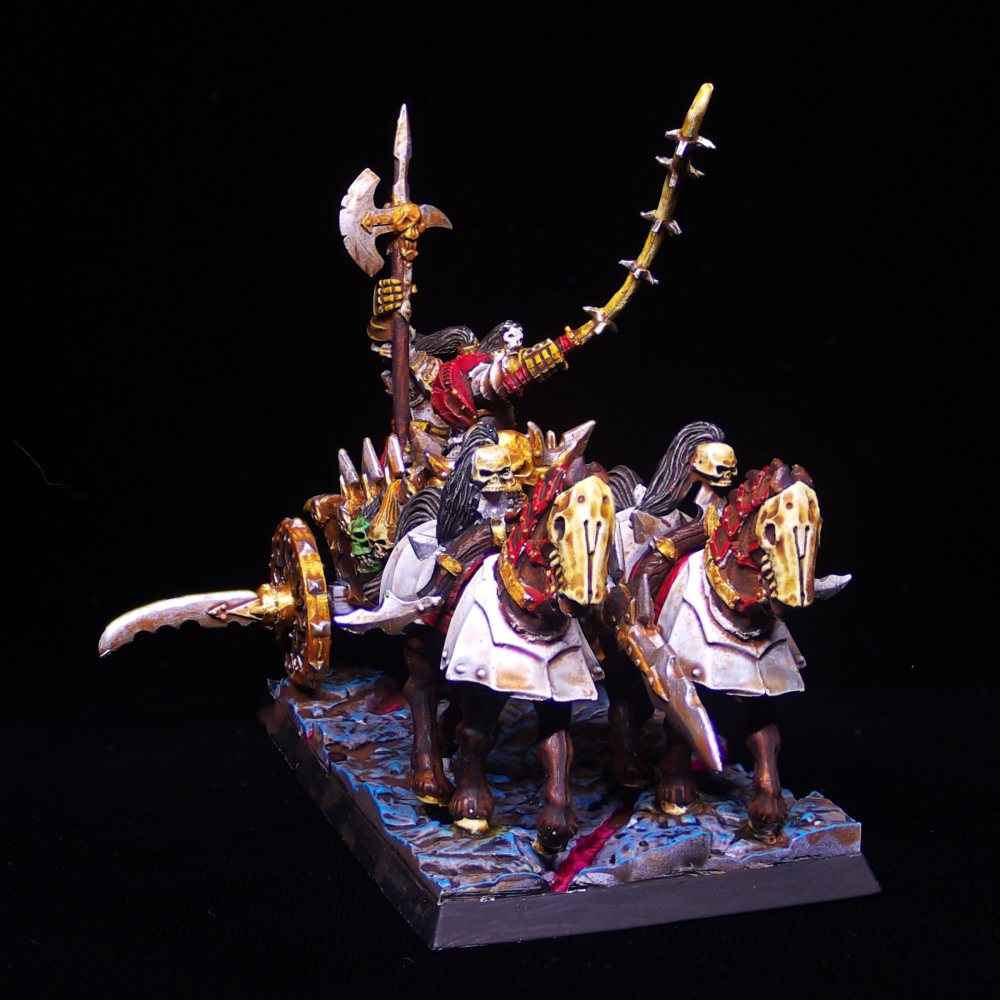

*Chaos Chariot, painted by Michael Timmermans.*

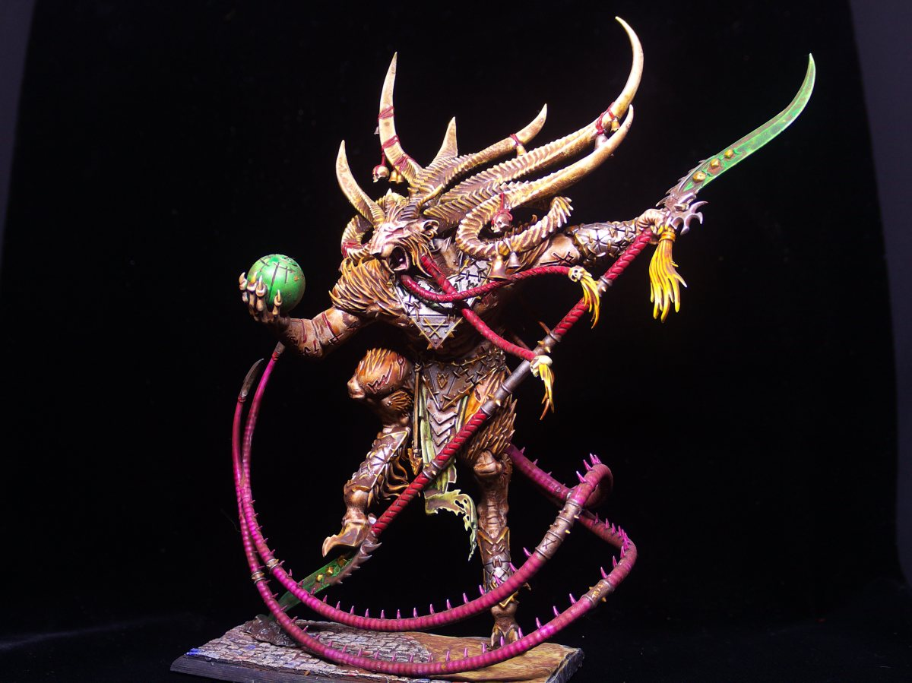

*Skaven Verminlord, painted by Michael Timmermans.*

Each source frame of the Verminlord is sharp at one depth only; the stack combines them:

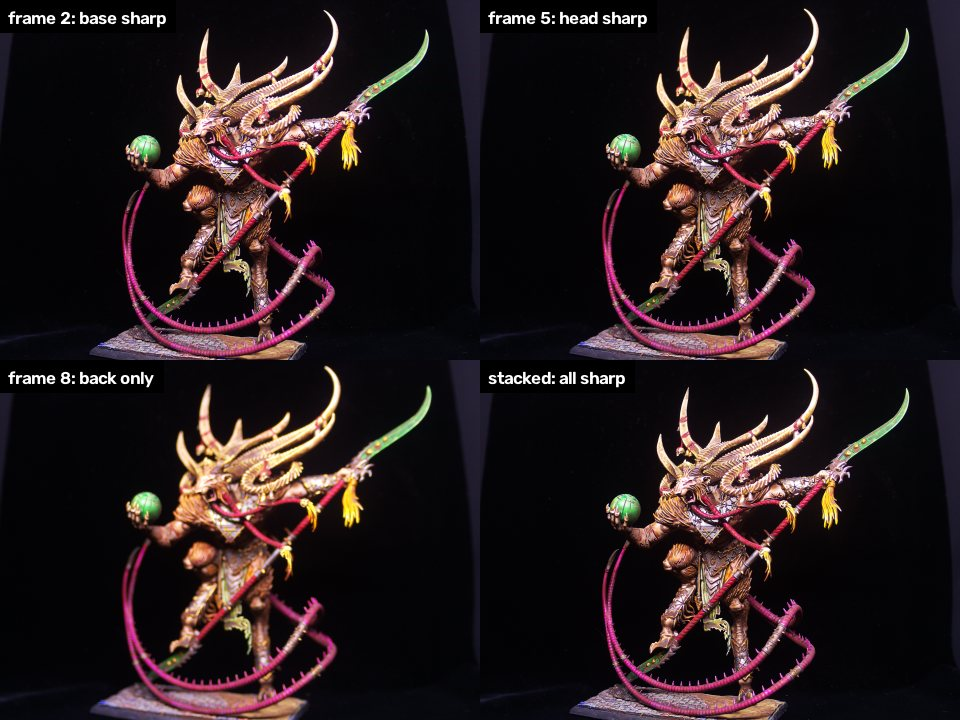

At 100 % — a single frame (focused on the base) next to the stacked result:

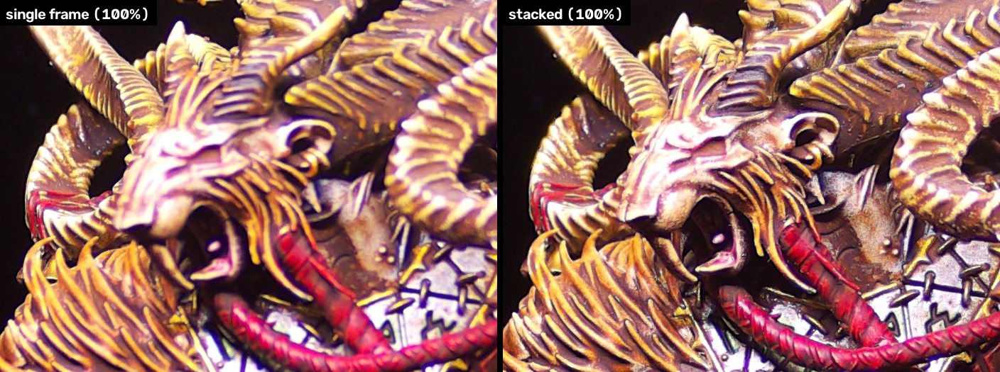

## Screenshots

The whole studio in one browser window — live preview with crop frame, clipping
warning and focus check on the left, histogram in the middle, capture controls
on the right. Works on a phone too.

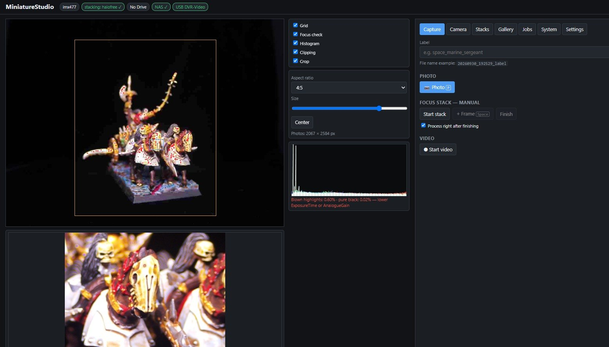

<table>
<tr><td align="center" valign="top"><a href="docs/screenshots/camera.jpg">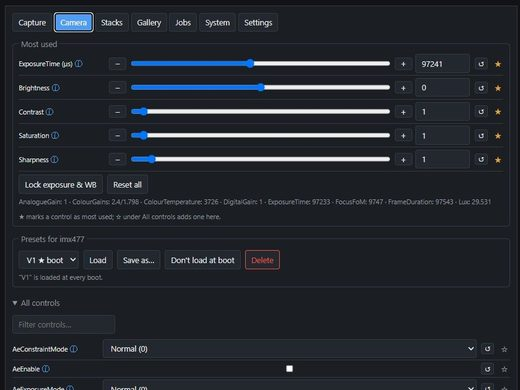</a><br><sub>Camera — most-used controls on top, ⓘ on every setting</sub></td><td align="center" valign="top"><a href="docs/screenshots/stacks.jpg">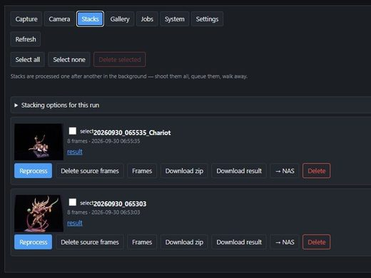</a><br><sub>Stacks — queue, reprocess, download, upload</sub></td><td align="center" valign="top"><a href="docs/screenshots/gallery.jpg">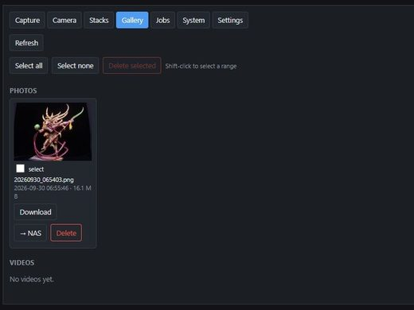</a><br><sub>Gallery — view, download, multi-select delete</sub></td></tr>
<tr><td align="center" valign="top"><a href="docs/screenshots/jobs.jpg">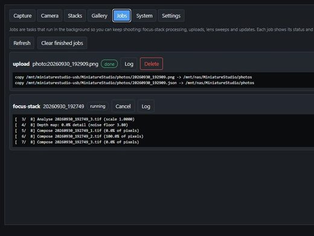</a><br><sub>Jobs — stacking and uploads in the background</sub></td><td align="center" valign="top"><a href="docs/screenshots/system.jpg">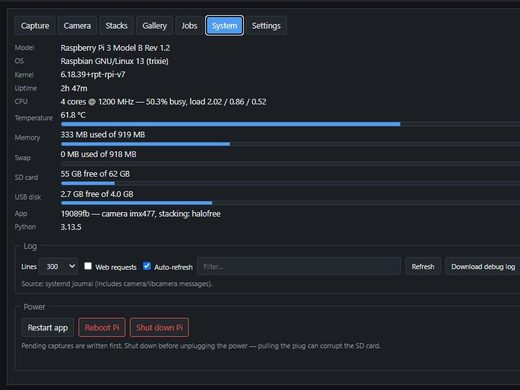</a><br><sub>System — Pi stats, logs, reboot / shut down</sub></td><td align="center" valign="top"><a href="docs/screenshots/settings.jpg">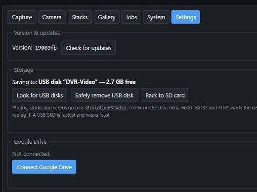</a><br><sub>Settings — updates, USB disk, Google Drive, NAS</sub></td></tr>
</table>

## The booth

A closed box keeps the light and background identical for every model: the
camera looks in through the front, the Pi sits on the back, and the walls are
painted with Black 3.0. The 3D-printable parts are on Thingiverse:
**[thing:7416432](https://www.thingiverse.com/thing:7416432)**.

<table>
<tr><td align="center" valign="top"><a href="docs/booth/booth-closed.jpg">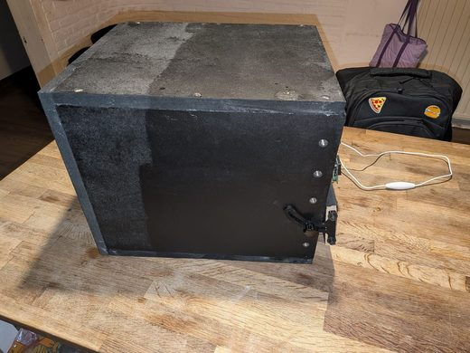</a><br><sub>The booth, closed</sub></td><td align="center" valign="top"><a href="docs/booth/booth-open.jpg">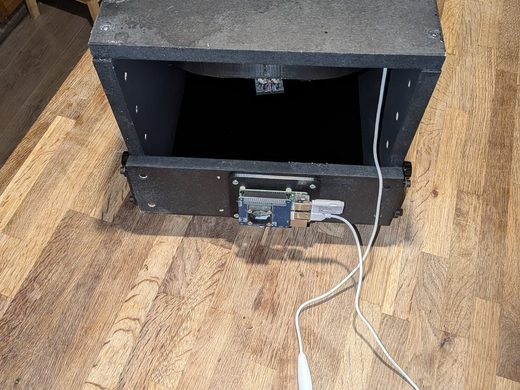</a><br><sub>Open front, Pi at the back</sub></td><td align="center" valign="top"><a href="docs/booth/booth-inside.jpg">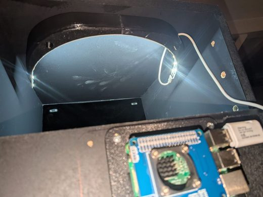</a><br><sub>Lit interior, Black 3.0 walls</sub></td></tr>
<tr><td align="center" valign="top"><a href="docs/booth/camera-mount.jpg">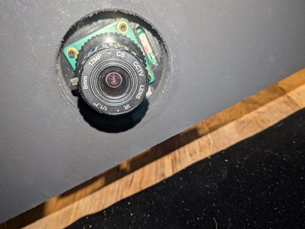</a><br><sub>HQ camera looking in</sub></td><td align="center" valign="top"><a href="docs/booth/electronics.jpg">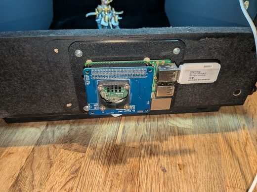</a><br><sub>Pi 3B, power HAT and USB disk</sub></td><td align="center" valign="top"><a href="docs/booth/tilt-bracket.jpg">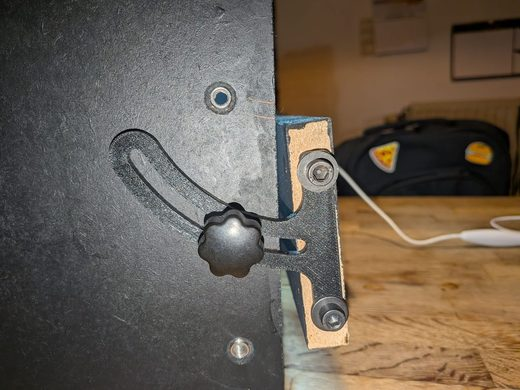</a><br><sub>Tilt bracket with locking knob</sub></td></tr>
</table>

## Features

- Live preview with grid, histogram, clipping warning and a 100 % focus check
- Every camera control in the browser, with presets that load at boot
- Photos, video, and **focus stacking** — manual, or an automatic lens sweep on
  autofocus cameras — with a halo-free method made for black backdrops
- Crop to a tall or wide frame before shooting
- Fast captures: saving, compressing, stacking and uploading run in the background
- Storage on the SD card or a USB disk; upload to Google Drive or a NAS
- Gallery with multi-select, System tab with Pi stats, logs, reboot/shutdown
- Updates from the web app; runs on a Raspberry Pi 3B

## Install

On a Raspberry Pi running Raspberry Pi OS (Bookworm or newer), as your normal user:

```bash
curl -fsSL https://raw.githubusercontent.com/MichaelTimmermans/MiniatureStudio/main/install.sh | bash
```

Or from a clone:

```bash
git clone --recurse-submodules https://github.com/MichaelTimmermans/MiniatureStudio.git
cd MiniatureStudio && ./install.sh
```

The installer:

1. installs the system packages from [`apt-packages.txt`](apt-packages.txt)
   (picamera2, Flask, OpenCV, ffmpeg, rclone, cifs-utils, nfs-common, …);
2. clones the app to `/opt/miniaturestudio` (or uses your clone);
3. builds [focus-stack](https://github.com/PetteriAimonen/focus-stack) from
   `vendor/focus-stack` (a git submodule) — roughly a quarter of an hour on a
   Pi 3B;
4. installs a small root helper for mounting a USB disk or NAS;
5. installs the `miniaturestudio` systemd service (starts at boot).

Then open `http://<hostname>.local:8000`.

## Updating

- In the web app: the app checks for updates when it starts (and every 6 hours)
  and shows a banner at the top of the page — **Show & install**. Or any time:
  **Settings → Check for updates → Install update**. The app restarts by itself.
- Or in a terminal: `miniaturestudio-update` (`--check` to only look).

Updates follow the `main` branch via `git pull`. New system packages, a new
focus-stack version or a new mount helper are picked up automatically.
Opening the page while the app restarts can briefly show "focus-stack
missing"; the page retries by itself.

## Documentation

- [Hardware](docs/hardware.md) — tested setup, lens and aperture, the
  3D-printable booth, supported cameras, Raspberry Pi 3B notes
- [Camera settings](docs/camera-settings.md) — starting settings for miniatures,
  presets, preview vs. photo
- [Focus stacking](docs/focus-stacking.md) — manual stacks, lens sweep, the
  halo-free method, tips
- [Cropping](docs/cropping.md) — tall or wide models
- [Storage and upload](docs/storage-and-upload.md) — file names, gallery, USB
  disk, Google Drive, NAS
- [Speed](docs/speed.md) — what runs in the background
- [Troubleshooting](docs/troubleshooting.md) — System tab, logs, common problems

## Tested hardware

Raspberry Pi 3B, Raspberry Pi HQ Camera (IMX477) with a 5-50 mm C-mount
varifocal lens, in a black booth — the 3D-printable parts are on Thingiverse:
[thing:7416432](https://www.thingiverse.com/thing:7416432). A USB webcam
(Sony IMX179) works too. Details and other cameras: [Hardware](docs/hardware.md).

## License

MIT — see [LICENSE](LICENSE).
The bundled focus-stack is © Petteri Aimonen, also MIT (see `vendor/focus-stack/LICENSE.md`).

## Built with Claude

This project was developed with the help of [Claude Code](https://claude.com/claude-code),
Anthropic's AI coding assistant.
