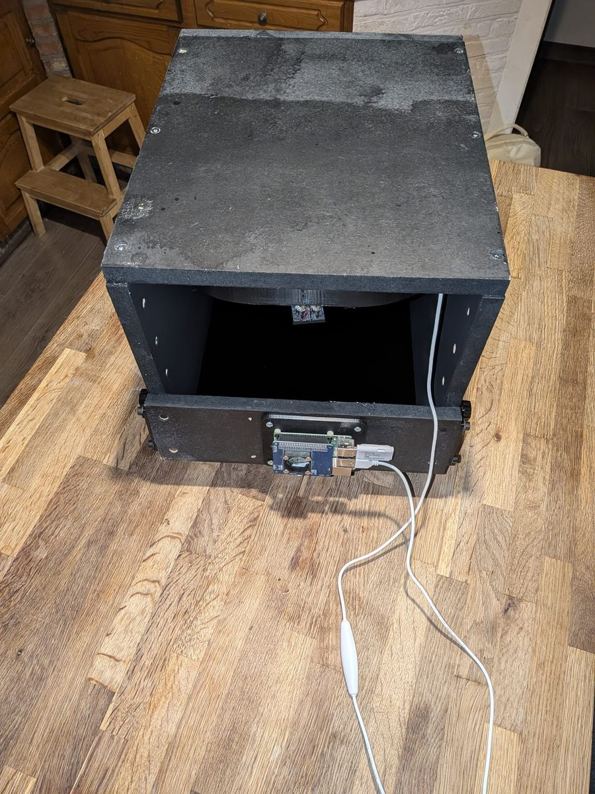

# Hardware

[← Documentation](README.md)

## Tested setup

What this app is developed and used with (the example photos in the README
were made with it):

- **Raspberry Pi 3B** (1 GB RAM), Raspberry Pi OS Trixie, powered through a
  power HAT fed by 12 V.
- **Raspberry Pi HQ Camera** (Sony IMX477, 12.3 MP, 1/2.3").
- **5-50 mm C-mount varifocal lens** (1/2.3", 12 MP rated) on the HQ camera's
  C-CS adapter ring, plus a macro/extension ring for close focus. Zoom first,
  then focus (varifocal lenses shift focus when zooming), and lock the rings.
- **Booth** of about 30×30×40 cm painted with Black 3.0, black velvet backdrop,
  model at 25-35 cm. The 3D-printable parts to build it are on Thingiverse:
  [thing:7416432](https://www.thingiverse.com/thing:7416432).

Also tested: a **USB webcam with a Sony IMX179** sensor — detected, preview and
photos work well; image quality is limited by the camera itself.

Not yet tested on real hardware: Arducam 16 MP / 64 MP sensors, Raspberry Pi 4/5.

## Lens and aperture

- Stacking provides the depth of field, so do not stop down far. On the HQ
  camera's 1.55 µm pixels diffraction softens the image from about F8; the
  sharpest setting is typically **F4-F5.6**.
- Find your lens's sweet spot with **Focus check**: click a detailed spot, keep
  the light the same, refocus, and compare the Sharpness value at F4, F5.6 and
  F8. The highest value wins.
- The sweet spot is not exactly the same at every zoom setting, and with a macro
  ring the effective aperture gets smaller (roughly f-number × (1 + magnification)).
  Test at the zoom and distance you use most, and again when you change a lot.
- The aperture is a ring on the lens, so the app cannot set it. Put it in the
  preset name as a reminder, e.g. "12mm F5.6".
- A thin blue/purple edge on bright contours is lens colour fringing (typical of
  CCTV varifocals). It shrinks a little when stopped down and is weaker in the
  middle of the frame, so zoom in and keep the model centred.

## Cameras

Connected cameras are detected at startup (`Picamera2.global_camera_info()`).
In the **Camera** tab you pick the active camera and can mark one as the
default (opened at boot). CSI cameras are not hot-pluggable: connect them with
the Pi switched off. Check with `rpicam-hello --list-cameras`.

All libcamera controls of the camera appear in the UI automatically; see
[Camera settings](camera-settings.md).

### Arducam 16MP / 64MP and other third-party sensors

Official Raspberry Pi cameras are detected automatically. Arducam's 16MP
(IMX519) and 64MP (Hawkeye, OV64A40) autofocus cameras need a line in
`config.txt`: **Camera tab → Camera sensor setup → pick the sensor → Apply &
reboot**. The app sets `camera_auto_detect=0` plus the right `dtoverlay`
(with a CAM0/CAM1 port on a Pi 5 or Compute Module) and keeps a backup as
`config.txt.miniaturestudio.bak`; "Auto-detect" undoes it. 64MP frames are
~190 MB in memory: use a Pi 4/5, or choose a lower **Capture resolution**.

For miniatures the HQ camera with a zoom lens is usually the better choice:
the Arducam modules have a fixed wide-angle lens, so filling the frame means
getting very close (distorted perspective, the camera in the way of the light,
very shallow depth of field). Their advantage is autofocus, which enables the
automatic lens sweep.

### USB webcams

UVC webcams work through the same app: pick them in the camera list (shown
as "(USB)"). Tested with a Sony IMX179 USB camera. MJPEG webcams are passed through without re-encoding — preview
and video (`.avi`, needs ffmpeg) cost the Pi almost nothing. YUYV-only
webcams do preview and photos but no video. USB cameras can be plugged in
while running: press **Rescan cameras**. Resolution: the webcam's largest
MJPEG size (override with `camera.usb_size` in `config.json`).

### Autofocus cameras (e.g. Camera Module 3, Arducam IMX519)

When the camera supports `AfMode`/`LensPosition`:

- an **Autofocus** button (one AF cycle, then the lens is locked in manual);
- the automatic **lens sweep** for focus stacking — see
  [Focus stacking](focus-stacking.md);
- stacks are always processed automatically (no Process button; only
  "Reprocess" if a run failed).

Manual-focus cameras such as the HQ Camera do not show the sweep; there you
stack manually (Start stack → Space per frame → Finish).

## Raspberry Pi 3B notes

- **Memory:** 1 GB is tight for 12 MP work. The app limits focus-stack to 1
  thread on a 1 GB Pi, pauses background compression while stacking and retries
  an out-of-memory run with lighter settings. Halo-free stacking needs only
  ~300 MB.
- **Swap:** check it in the System tab. Bookworm: set `CONF_SWAPSIZE=2048` in
  `/etc/dphys-swapfile`, then `sudo systemctl restart dphys-swapfile`. Trixie
  configures swap differently (zram + swapfile via `rpi-swap`).
- **PNG encoding of 12 MP takes 10-15 s** — that is why frames are written as
  raw TIFF first and compressed in the background (see [Speed](speed.md)).
- **USB 2.0 only** (~35 MB/s, shared): a USB SSD beats a cheap stick.
- A **Pi 4/5 with 4 GB** makes stacking several times faster and allows batch
  size 0 and full-resolution alignment. The Pi 5 needs a different camera cable
  (22-pin) and a 5 A supply.
- Always **shut down** from the System tab before unplugging — pulling the power
  can corrupt the SD card.
